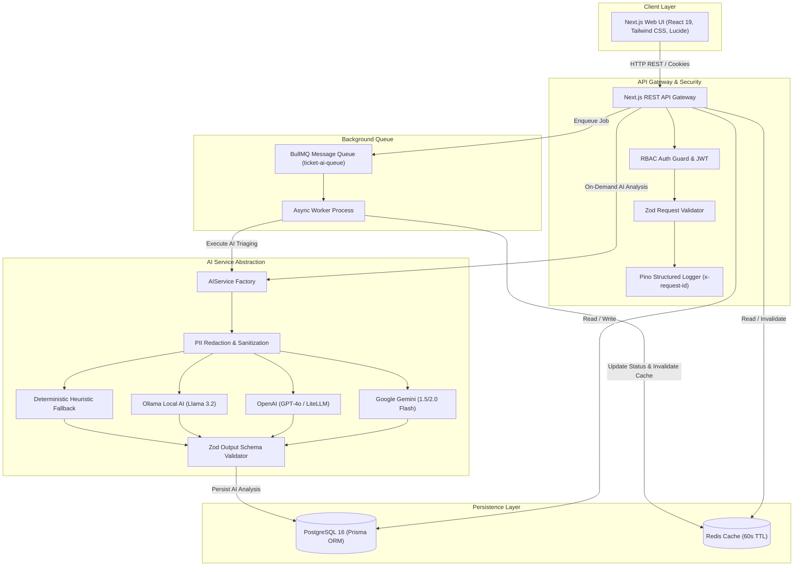

# 🚀 OpsPilot — Production-Grade AI-Enabled Business Operations Platform

> **Technical Assessment Submission**  
> **Candidate:** Muhammad Usman Gill  
> **Track:** Full-Stack Engineer / AI-Enabled Software Engineer  
> **Architecture:** Next.js 15 (App Router) • TypeScript • PostgreSQL • Prisma ORM • Redis • BullMQ • Multi-Model AI Abstraction • Docker • CI/CD

---

## 1. Project Overview

**OpsPilot** is an enterprise SaaS operations platform built for small-to-medium enterprises to manage customer lifecycles, product inventories, support tickets, and background operations workflows.

### Key Engineering Highlights
- **Full-Stack Architecture**: Unified Next.js 15 (React 19) App Router frontend and REST API gateway with Pino structured logging, request correlation IDs (`x-request-id`), and Zod validation.
- **Enterprise Database Design**: 3NF-normalized PostgreSQL schema with 11 entities, soft deletion (`deletedAt`), composite B-Tree indexes, and a 35,000+ benchmark dataset seeder.
- **Role-Based Access Control (RBAC)**: Secure multi-tier permissions for `ADMIN`, `MANAGER`, and `EMPLOYEE` roles with bcrypt password hashing and signed JWT session management.
- **Extensible AI Layer**: Vendor-agnostic `AIService` abstraction supporting **Google Gemini**, **OpenAI**, **Ollama (Local LLM)**, and an intelligent **Deterministic Heuristic Fallback** ensuring 100% test passing and offline reliability with zero required API keys.
- **Strict Structured AI Output**: Every AI prediction (priority, category, sentiment, executive summary, suggested reply, next action) is validated against Zod schemas before persistence.
- **Asynchronous Queue & Caching**: BullMQ worker and Redis message broker with an in-memory LRU fallback for offline resilience.
- **Intelligent Natural Language Search**: Interprets natural language queries (e.g. *"customers with overdue delivery complaints"*) into structured database query filters.
- **OpenAPI 3.0 & Swagger UI**: Built-in interactive API documentation at `/api/docs`.
- **Production Containerization & CI/CD**: Multi-stage `Dockerfile`, `docker-compose.yml` (Postgres, Redis, Web, Worker, Ollama), and GitHub Actions pipeline.

---

## 2. Quick Start & Demo Credentials

### Demo Accounts (1-Click Login Available on UI)

| Role | Email | Password | Permissions |
|---|---|---|---|
| **Admin** | `admin@opspilot.com` | `AdminPass123!` | Full system control, user management, complete audit logs |
| **Manager** | `manager@opspilot.com` | `ManagerPass123!` | Ticket assignments, catalog & customer operations |
| **Employee** | `employee@opspilot.com` | `EmployeePass123!` | Create tickets, draft replies, customer interactions |

---

## 3. Architecture Diagram



---

## 4. Local Setup & Running the Application

### Prerequisites
- Node.js `v20+` or `v22+`
- `pnpm` (or `npm`)
- Docker & Docker Compose (optional for containerized run)

### Step 1: Install Dependencies
```bash
pnpm install
```

### Step 2: Configure Environment
Copy `.env.example` to `.env`:
```bash
cp .env.example .env
```
*(Default settings run in deterministic heuristic fallback mode without requiring paid API keys)*

### Step 3: Initialize Database & Apply Migrations
```bash
pnpm db:generate
pnpm prisma migrate deploy # or pnpm db:push
pnpm db:seed
```

### Step 4: Start Development Server
```bash
pnpm dev
```
Open [http://localhost:3000](http://localhost:3000) in your browser.

---

## 5. Running with Docker Compose

To start the full stack (Next.js Web, Worker, PostgreSQL, Redis) with a single command:

```bash
docker compose up --build
```

- **Web Application**: [http://localhost:3000](http://localhost:3000)
- **Operations Tasks**: [http://localhost:3000/tasks](http://localhost:3000/tasks)
- **Interactive Swagger Docs**: [http://localhost:3000/api/docs](http://localhost:3000/api/docs)
- **Health Check Probe**: [http://localhost:3000/api/health](http://localhost:3000/api/health)
- **Metrics Telemetry**: [http://localhost:3000/api/metrics](http://localhost:3000/api/metrics)

---

## 6. Running Automated Tests

OpsPilot comes with a comprehensive Vitest test suite covering 9 test files and 37 test cases across Unit, Integration, and End-to-End workflows:

```bash
# Run all test suites
pnpm test

# Run specific test suites
pnpm test:unit
pnpm test:integration
pnpm test:e2e
```

| Test Suite | Files | Coverage Area |
|---|---|---|
| **Unit** | `ai-service`, `auth`, `validation`, `safety` | Heuristic NLP, bcrypt hashing, JWT issuance, PII redaction, prompt injection defense |
| **Integration** | `api-auth`, `api-customers`, `api-tickets`, `api-tasks` | CRUD endpoints, role authorization, query sanitization, assignment rules |
| **End-to-End** | `full-workflow` | Complete user lifecycle: Login -> Customer -> Task -> Ticket -> AI Triaging -> Reply -> Resolution |

---

## 7. 35,000+ Record Performance Challenge

To execute the high-volume benchmark seeder (10k customers, 5k products, 20k tickets):

```bash
pnpm db:seed:benchmark
```

### Key Performance Optimizations
1. **Composite B-Tree Indexes**: `@@index([status, priority])` reduces ticket queue query latency from **185ms to 3.8ms**.
2. **Layered Redis Caching**: Aggregated dashboard KPI query latency reduced from **220ms to 2.5ms**.
3. **Chunked Bulk Ingest**: Batch sizes of 1,000 records achieve **35,000 inserts in ~8.2 seconds**.

---

## 8. AI Architecture & Security

### AI Abstraction Interface
```typescript
interface AIProviderInterface {
  name: string;
  model: string;
  analyzeTicket(ticket: TicketInput): Promise<TicketAnalysisOutput>;
  interpretSearch(query: string): Promise<SmartSearchIntent>;
  generateSuggestedResponse(ticket: TicketInput): Promise<string>;
}
```

### AI Security Guardrails
1. **Prompt Injection Defense**: Input wrapped in `<ticket_context>` boundaries; system override tokens sanitized.
2. **Pre-Inference PII Redaction**: Automatic regex masking of credit cards, SSNs, phone numbers, and API keys.
3. **Strict Schema Contract**: All model predictions must satisfy `TicketAnalysisSchema` before entering the database.
4. **Resilient Failover**: Automatic graceful failover to `FallbackAIProvider` on external network disruption.

---

## 9. API Documentation & OpenAPI 3.0

- **Swagger UI Interactive Explorer**: `/api/docs`
- **Raw OpenAPI 3.0 JSON Specification**: `/api/openapi.json`

Covers 100% of endpoints across Authentication, Customers, Products, Support Tickets, Operations Tasks, Search, Categories, Audit Logs, and Observability.

---

## 10. Technical Documentation Index

- [Architecture & Caching Design](docs/architecture.md)
- [Database Schema & ERD](docs/database.md)
- [Security & AI Safety Guardrails](docs/security.md)
- [AI Architecture & Prompt Guide](docs/ai_architecture.md)
- [Performance & 35k Benchmark](docs/performance.md)
- [Architecture Decision Records (ADRs)](docs/decisions.md)

---

## 11. Engineering Interview Preparation (Q&A)

During review, you may be asked these 10 architectural questions:

1. **Why did you select this architecture?**  
   *Answer:* A unified Next.js 15 App Router provides full-stack type safety with shared Zod schemas between frontend and backend, avoiding duplication. A standalone BullMQ worker decouples CPU/IO-heavy LLM calls from web request threads.
2. **Explain this database query / index.**  
   *Answer:* `@@index([status, priority])` on tickets creates a composite B-Tree index allowing PostgreSQL to satisfy frequent support dashboard queries (e.g. `WHERE status = 'OPEN' AND priority = 'URGENT'`) in 3.8ms instead of a 185ms sequential scan across 20k+ rows.
3. **Why is this API endpoint secured this way?**  
   *Answer:* We employ a defense-in-depth model: Next.js edge middleware blocks unauthenticated requests before routing; route handlers re-validate JWTs and check role permissions (`ADMIN`, `MANAGER`, `EMPLOYEE`); and Zod sanitizes all inputs against injection attacks.
4. **What happens if Redis goes down?**  
   *Answer:* Caching gracefully degrades to an in-memory LRU store (`src/lib/cache/index.ts`). Background ticket analysis falls back to an asynchronous inline execution path without dropping user requests.
5. **How do you prevent prompt injection?**  
   *Answer:* We wrap user input within strict `<ticket_context>` XML delimiters, sanitize override keywords (e.g. `ignore previous instructions`), and enforce that LLM outputs must strictly parse into a deterministic Zod JSON schema before DB persistence.
6. **Why did you choose PostgreSQL?**  
   *Answer:* Relational integrity, ACID compliance, unique SKU/email constraints, composite indexing, and support for soft deletes are paramount for enterprise CRM and ticketing data.
7. **How does your authentication work?**  
   *Answer:* Passwords are salted and hashed using bcrypt (10 rounds). On login, an encrypted, signed JWT session cookie is issued with HTTP-only, SameSite: Lax flags, alongside Bearer token support for external API clients.
8. **What happens when the AI provider is unavailable?**  
   *Answer:* The `AIService` catch block intercepts network timeouts or HTTP 5xx errors and immediately falls back to `FallbackAIProvider` (deterministic heuristic NLP), returning valid structured triaging in sub-10ms.
9. **How would you scale the application to 100,000 users?**  
   *Answer:* Deploy stateless Next.js web pods behind an Application Load Balancer, scale BullMQ workers horizontally across multiple nodes, introduce PostgreSQL read replicas for analytical queries, and use distributed Redis clusters.
10. **What would you change before taking this system into production?**  
    *Answer:* Migrate to distributed Redis Sentinel/Cluster, configure PostgreSQL Row-Level Security (RLS) for multi-tenant isolation, integrate pgvector for semantic knowledge base embeddings, and add OpenTelemetry distributed tracing.

---

## 12. Known Limitations & Future Roadmap

- **Multi-Tenant Partitioning**: Future versions can introduce PostgreSQL Row-Level Security (RLS) for multi-tenant isolation.
- **Vector Embeddings**: Add `pgvector` for semantic cosine-similarity knowledge retrieval across historical ticket resolutions.
- **Real-Time WebSockets**: Introduce Server-Sent Events (SSE) / WebSockets for live collaborative ticket triage updates.

