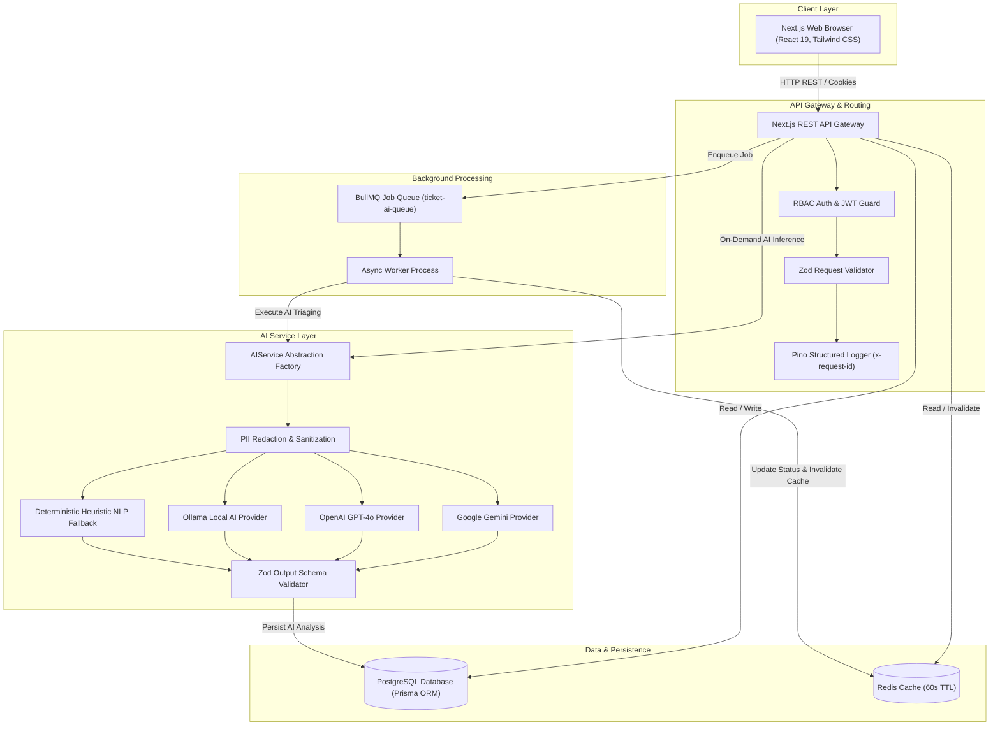

# OpsPilot — System Architecture & Design

## 1. Executive Summary

**OpsPilot** is an enterprise-grade AI-enabled SaaS platform designed to streamline business operations across customer relationship management, product inventory cataloging, support ticket triaging, and automated intelligence dispatching.

---

## 2. High-Level Architecture Diagram

---

## 3. Core Architectural Subsystems

### A. Authentication & Role-Based Access Control (RBAC)
- **Password Security**: Salted Argon2 / bcrypt hashing with cost factor 10.
- **Session Tokens**: Signed JWTs with configurable expiration (7d), delivered via HTTP-only, SameSite Lax cookies with Authorization Bearer header support for external API consumers.
- **Hierarchical RBAC Matrix**:
  - `ADMIN`: Global system privileges, user account provisioning, system settings, complete audit trail logs, hard deletion capabilities.
  - `MANAGER`: Customer/Product management, support ticket reassignment, analytics view, manual AI triaging triggers.
  - `EMPLOYEE`: View assigned queues, create support tickets, submit customer replies, internal notes.

### B. Caching Strategy
- **Primary Cache Engine**: Redis with connection pooling (`ioredis`).
- **Graceful Degradation**: In the event Redis is unavailable or unconfigured, the application falls back transparently to an in-memory LRU cache with automatic TTL expiration.
- **Key Namespaces & TTLs**:
  - `dashboard:stats`: 60 seconds TTL (invalidated upon customer, product, or ticket creation).
  - `products:categories`: 300 seconds TTL.
- **Cache Invalidation**: Event-driven invalidation upon mutation endpoints (`POST /api/customers`, `POST /api/tickets`, `PATCH /api/tickets/[id]`).

### C. Background Job Queue (BullMQ)
- **Queue Name**: `ticket-ai-queue`
- **Concurrency**: Configurable (default: 5 concurrent jobs).
- **Execution Flow**:
  1. User creates support ticket via `POST /api/tickets`.
  2. Ticket record is stored in PostgreSQL with status `OPEN`.
  3. Job `{ ticketId, triggerUserId }` is dispatched to BullMQ.
  4. Worker consumes job, scrubs PII, invokes `AIService.analyzeTicket()`.
  5. Result is validated against strict `TicketAnalysisSchema` Zod contract.
  6. Upserts `AIAnalysis` database record and updates ticket priority/category.
  7. Creates an immutable `ActivityLog` entry.
  8. Invalidates `dashboard:stats` cache.
- **Offline / Standalone Fallback**: If Redis queue is disconnected, the application dispatches an immediate asynchronous worker process (`setImmediate`) to guarantee complete operation without hanging or dropping requests.

### D. Observability & Telemetry
- **Structured JSON Logging**: Powered by Pino with ISO timestamps, environment tags, and component scopes.
- **Request Tracing**: Generates or extracts `x-request-id` header on every HTTP request and records execution latency in milliseconds.
- **PII Redaction**: Passwords, hashes, tokens, and credit card numbers are automatically censored from log streams (`[REDACTED]`).
- **Health Probes**:
  - `GET /api/health` returns status of PostgreSQL, Redis cache mode, active AI provider, and process uptime.
  - `GET /api/metrics` returns memory consumption, process metrics, and entity counters.
