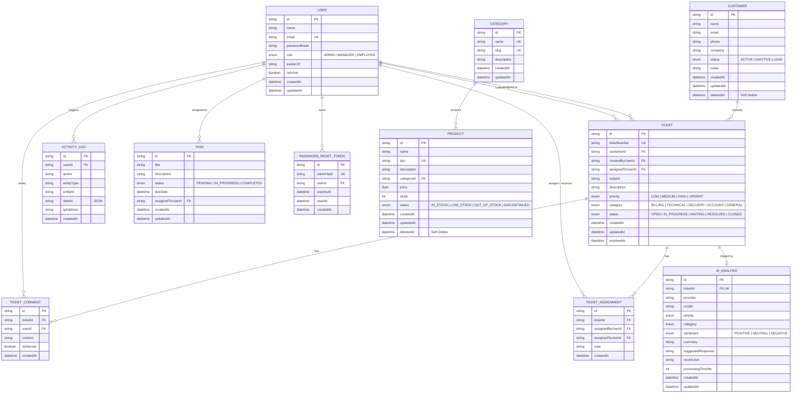

# OpsPilot — Database Design, ERD & Indexing Strategy

## 1. Overview
The persistence layer of OpsPilot is built on PostgreSQL 16 managed via Prisma ORM. The schema is 3NF normalized across 11 core tables with referential integrity, cascading deletion policies, and targeted indexing for low-latency pagination and high-throughput search.

---

## 2. Entity Relationship Diagram (ERD)

---

## 3. Database Normalization & Integrity
1. **Email & SKU Uniqueness**: Unique constraints are placed on `User.email`, `Category.slug`, `Product.sku`, and `Ticket.ticketNumber` to eliminate data anomalies.
2. **Soft Deletion (`deletedAt`)**: Implemented on `Customer` and `Product` tables to maintain audit compliance and preserve historical references in previous support tickets and invoices.
3. **One-to-One AI Analysis**: `AIAnalysis.ticketId` is unique and has cascade deletion linked to its parent ticket.

---

## 4. Indexing Strategy & Optimization
- **Composite Indexes**:
  - `Customer(status, deletedAt)`: Optimizes filtered listing queries avoiding full table scans.
  - `Product(categoryId, deletedAt)` & `Product(status, deletedAt)`: Speeds up catalog filtering.
  - `Ticket(status, priority)`: Essential for support dashboard queues (e.g. finding urgent open tickets).
  - `TicketComment(ticketId, createdAt)`: Enables instant rendering of chronological ticket conversation threads.
  - `ActivityLog(entityType, entityId)` & `ActivityLog(userId, createdAt)`: Optimizes audit trail queries.
